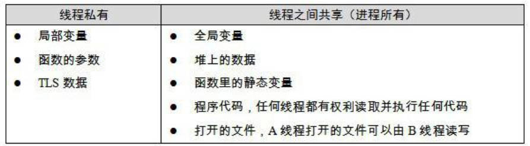
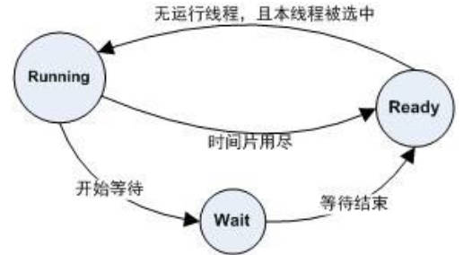

# Linklibrary_intro

## 1.计算机软硬件体系概述

### 1.1 硬件

就系统开发者来说，计算机硬件设备中关心的部件主要有 3 个：CPU，内存，I/O 控制芯片。

早期人们设置高速的北桥 (Northbridge，PCI Bridge) 芯片，用于协调 CPU 和内存间高速交换数据，后续又设计专门处理低速设备的南桥芯片，如键盘，USB，鼠标等都连在南桥上，最后由南桥汇总后将其连接到北桥上。

早期 (20 世纪 90 年代) 的 PC 机系统总线采用的是 PCI 结构，低速设备上采用的是 ISA 总线，即 PCI/ISA 即南北桥设计的硬件架构。

**SMP**

CPU 的频率方面提升在物理方面已经接近极限，人们采用增加 CPU 的数量来提升 CPU 的速度，但是实际提升的效果与数量并不成正比。使用多 CPU 常见的一种形式为：对称多处理器 (SMP，Symmetrical MultiProcessing)，即每个 CPU 的地位等同，相互对称。

**多核处理器**

Multicore Processor，简化版的 SMP，即多个处理器共享成本较高的缓存部件，只保留多核心。

扩展阅读：[The Free Lunch Is Over: A Fundamental Turn Toward Concurrency in Software](http://www.gotw.ca/publications/concurrency-ddj.htm)

### 1.2 软件

传统意义上的区分：

将用于管理计算机本身的软件称为系统软件，可分为：

- 平台性的，操作系统内核，驱动程序，运行库及系统工具；
- 用于程序开发的，编译器，汇编器，连接器等

计算机系统软件体系结构的设计要点：**层次结构设计**，每个层次间通过接口 (Interface) 进行通信。

日常使用的应用程序使用的是操作系统应用程序编程接口 (Application Programming Interface，API)，运行库使用 OS 提供的系统调用接口 (System call Interface)，其往往通过软件中断 (Software Interrupt) 的方式提供。

操作系统内核层是硬件接口的使用者，硬件则是接口的定义者，这种接口也被称为硬件规格 (Hardware Specification)，OS 和驱动程序开发者通过阅读硬件规格文档编写响应的 OS 和驱动程序。

**OS 的作用**

OS，Operating System，操作系统的功能：

- 提供抽象的接口；
- 管理硬件资源；

### 1.3 CPU/IO/内存

计算机的硬件设备能力是有限且固定的，如何**充分利用硬件的能力**是十分必要的：

- OS 的**多任务功能**使得 CPU 可以在多个进程间很好地共享
- OS 的 **I/O 抽象模型**可很好地实现 I/O 设备的共享和抽象
- 内存管理使用**虚拟地址和分页方法**

**1.充分利用 CPU**

早期的多道程序 (Multiprogramming) 未区分轻重缓急，调度策略粗糙；

分时系统 (Time-Sharing System)，后续改进为一种程序协作模式，每个程序运行一段时间后都会主动出让 CPU 给其他程序，可保证一定时间内每个程序都有机会运行一小段时间，对及时交互处理十分重要；

多任务系统 (Muti-tasking)，操作系统管理所有的硬件资源，本身运行在受硬件保护的级别。所有的程序以进程 (Process) 的方式以权限更低的级别运行，CPU 由 OS 统一调度，每个进程根据优先级的高低都有机会得到 CPU。

**2.设备驱动**

OS 系统中的硬件驱动避免应用程序的开发者与硬件直接打交道，将硬件逐渐抽象为一系列概念。硬件驱动 (Device Driver) 可看作是 OS 的一部分，但与 OS 内核具有一定的独立性，具有较好的灵活性。

**3.内存的分配**

早期的计算机程序直接访问的地址是物理地址，即直接运行在物理内存上，出现的问题：

- 地址空间不隔离，恶意程序容易更改内存空间中的数据
- 内存使用效率低，往往将整个程序转入内存，后续运行其他程序时需要大量数据换入换出
- 程序运行的地址不确定性

解决方法：添加中间层，使用虚拟地址 (Virtual Address) 的间接地址访问算法。

虚拟地址做到了地址隔离，程序被映射到不同的物理空间区域；而为了提供内存的使用率，可以使用分页 (Paging) 的基本方法，将地址空间人为划分为固定大小的页，将常用的代码和数据装载到内存中，不常用的则保存在磁盘中；虚拟储存的实现需要硬件的支持，几乎所有的硬件都采用 MMU (Memory Management Unit) 的部件进行页映射。

### 1.4 线程

**线程简介**

线程 (Thread) 有时称为轻量级进程 (Lightweight Process，LWP)，程序执行流的最小单元。一般来说，一个进程由多个线程组成，各个线程间共享程序的内存空间。

一个标准的线程组成为：

- 线程 ID
- 当前指令指针 PC
- 寄存器集合
- 堆栈

多线程的操作可以有效利用等待的时间；处理消耗大量时间的操作的同时完成和用户的交互；多线程在数据共享方面的效率要高很多。

线程的访问非常自由，它可以访问进程内存中的所有数据，甚至其他线程的堆栈。线程拥有自己的私有存储空间，包括：

- 栈
- 线程局部存储 (Thread Local Storage，TLS)
- 寄存器

**线程调度**

线程数 ≤ 处理器数量：真正的并发执行；而单处理器对应多线程的情况，会不断切换不同的线程，即进程调度 (Thread Schedule)，其中线程的状态为：

- 运行 (Running)
- 就绪 (Ready)
- 等待 (Waiting)

线程拥有时间片 (Time Slice) 用完就会进入就绪状态，如果在用尽前进程就开始等待某个事件，则进入等待状态；当等待事件发生后，就会进入就绪状态。

主流的调度方式都带有优先级调度 (Priority Sechedule) 和轮转法 (Round Robin) 的痕迹。

- 轮转法:：让各个线程轮流执行一小段时间，使得线程交错执行；
- 优先级调度：根据线程的优先级 (Thread Priority) 执行；

**优先级调度**

线程的优先级可以由用户手动设置，系统也会根据线程的表现自动调整优先级；频繁进入等待状态的线程称为 IO 密集型线程 (IO Bound Thread)，少等待的进程称为 CPU 密集型线程 (CPU Bound Thread)，IO 密集型更容易得到优先级的提升。

优先级改变的三种方式：

- 用户指定优先级
- 根据等待状态的频繁程度提升或降低优先级
- 长时间得不到执行而被提升优先级，避免饿死 (Starvation) 的现象

**抢占线程和不可抢占线程**

抢占 (Preemption)：时间片用完后强制剥夺继续执行的权利，进入就绪状态

早期的不可抢占进程需要主动放弃执行：程序试图等待某事件；线程主动放弃时间片；其显著的特点是线程的调度时机确定，有利于线程安全性，但现在很少见。

**Linux 多线程**

Windows 对进程和线程有明确的标准，而 Linux 并不存在真正意义上的线程概念。Linux 将所有的执行实体称为任务 (Task)，类似于一个单线程的进程，但是不同的任务间可以共享内存空间。

**Fork**：本质来说，共享同一个内存空间的多个任务构成了一个进程。fork 函数产生一个和当前进程完全一样的新进程，单并不复制原任务的内存空间，而是和原任务共享一个写时复制 (Copy on Write，COW) 的内存空间。COW 指的是两个任务可同时自由读取内存，任意一个试图更改内存时，内存会提供自身的镜像供修改方单独使用。

