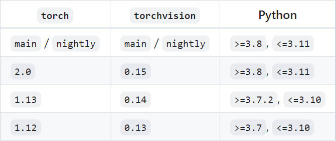

# 简介

## 0.历史

FAIR（ Facebook AI Research，Facebook人工智能研究院 ）于2017年初发布 PyTorch，早期的 Torch 使用 Lua 语言作为接口，门槛较高。后期使用 python 语言对接口进行重构，推出了 Pythorch。

简单来说，Pytorch 就是一个 Python 工具包，通过 `import torch` 导入使用

## 1.安装

### 1.1 CPU 版本

**推荐方法**

PyTorch 是一个加速算法模型研究到产品部署的开源机器学习框架

推荐使用 ：[官方下载地址](https://pytorch.org/get-started/locally/)，此处以 CPU 版本为例：

```shell
# 安装 3 个包，分别是torch, torchvision,torchaudio
pip3 install torch torchvision torchaudio
```

**其他方法**

若下载速度过慢，可离线下载对应的包，手动进行安装：[whl 下载地址](https://download.pytorch.org/whl/torch_stable.html) | [CSDN 教程](https://blog.csdn.net/qq_51983316/article/details/128038963?spm=1001.2101.3001.6650.2&utm_medium=distribute.pc_relevant.none-task-blog-2%7Edefault%7ECTRLIST%7ERate-2-128038963-blog-121309063.pc_relevant_landingrelevant&depth_1-utm_source=distribute.pc_relevant.none-task-blog-2%7Edefault%7ECTRLIST%7ERate-2-128038963-blog-121309063.pc_relevant_landingrelevant&utm_relevant_index=5)

将下载好的文件移动到对应的目录中即可：

```shell
#先安装torch
pip install "torch-1.8.0+cpu-cp38-cp38-win_amd64.whl"
#安装torch成功后再安装torchvision
pip install "torchvision-0.9.0+cpu-cp38-cp38-win_amd64.whl"
```

手动下载的还需注意 pytorch 与 torchvision 版本对应关系，给出最近版本说明，具体可查找：[torchvision](https://github.com/pytorch/vision)



安装完成后检测：
```python
import  torch

print(torch.__version__)
print('gpu:', torch.cuda.is_available())
```

## 2.文档说明

`Torch_intro.md`：以龙良曲讲解视频为主，参考对应的[课程代码](https://github.com/dragen1860/Deep-Learning-with-PyTorch-Tutorials)

基于前期的 TF 学习基础，整个文档采用结合 YOLO 模型的方式进行学习


