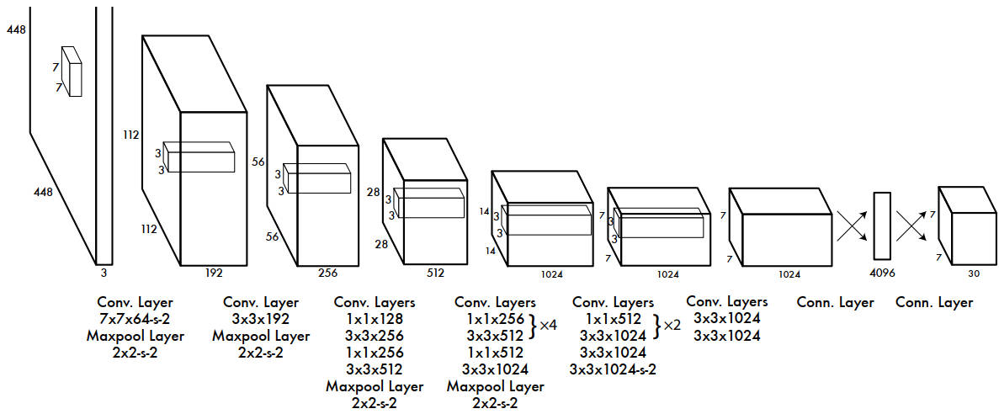

# Pytorch_intro

> [官网](https://pytorch.org/) | [帮助文档](https://pytorch.org/docs/stable/index.html)

## 1.Pytorch 模块

基础入门：[动手学深度学习-Pytorch实现](https://zh.d2l.ai/chapter_preface/index.html)

### 1.1 文件夹内容说明

**Torch 文件夹**

位置：`\Lib\site-packages\torch` 

1.`__pycache__`：一个缓存文件夹，保存由 python 解释器将对应模块提前生成的字节码，节省后续时间单增加了存储空间

2.`_C`：辅助 C 语言调用，PyTorch 的底层计算代码采用的是C++语言编写并封装成库，供 pytorch 的 python 语言进行调用

3.`include`：C++ 头文件代码

4.`lib`：包含大量的 `.lib` 和 `.dll` 文件，即静态链接库和动态链接库，供各类顶层 python api 调用

5.`autograd`：实现梯度的自动求导，开发者只需编写前向传播代码

6.`nn` 和 `optim`：核心网络层模块和优化模块

**Torchvision 文件夹**

位置：`\Lib\site-packages\torchvision` 

1.`datasets`：官方的数据读取函数，如 coco，mnist，cifar 等

2.`models`：经典可复现的模型库，可模仿代码结构，函数，类组织等

3.`tansforms`：视觉增强库，pytorch 自带的图像预处理，增强，转换工具

### 1.2 快速入门

## 2.YOLO 算法

> 相关论文搜索：https://arxiv.org/

### 2.1 概述

图像分类 (Classification) ：仅做整体图片的分类，**即输出对应图片的类别**

图像分类+定位 (Localization)：将图像中的物体框选出来定位

目标检测 (Object Detection)：多个类别，**多个物体框选出来并分类**，实现每个物体的区分

**图像分割 (Segmentation)**

语义分割 (Semantic Segmentation)：对每个像素分类

实例分割 (Instance Segmentation)：进一步区分同一类比的不同实例，精确到每个个体

关键点检测 (Keypoint Detection)：检测肢体动作

**目标检测**

单阶段模型：端到端的，直接输入，得到输出，如 YOLO

两阶段模型：先提取，再分类，准确性较高但是耗时

### 2.2 YOLOV1

#### 1.预测阶段

**模型已经训练成功**，输入未知图片对其进行预测，只需要前向推断，得到预测结果。

**输入：448×448×3**

**输出：7×7×30**  每个网格包含两个预测框和 20 个类别的条件概率，每个个框包含 5 个参数 (x, y, w, h, c)

**组成分析**

划分为 s × s 个网格，每个网格对应 b 个预测框，此处 s = 7,b= 2

7×7×64-s-2：64 卷积核的个数，stride ：2

- 24 个全连接层提取图像特征：1 + 1 + 4 + (2×4 + 2) + (2×2 + 1) + 2 + 1 = 24

- 2 层全连接层得到 7×7×30 ，4096 => 1470 => 7×7×30

S 个 girdcell B 个 bounding box。对于 YOLOV1，图片分成 7×7 的网格，每个 girdcell 生成 2 个中心点在网格内的 bounding box (预测框)。

预测框包含 (x, y, w, h, c)：(x, y) 为中心点的坐标，(w, h) 为框的宽高，c 是判断的置信度，在图像中表示为线框的粗细。

①：各个 girdcell 对应的 bounding box(一般2个) 和相应置信度的大小

②：girdcell 对所**包含**各类别的概率

#### 2.预测框筛选

将生成后的众多预测框进行筛选过滤，获得

