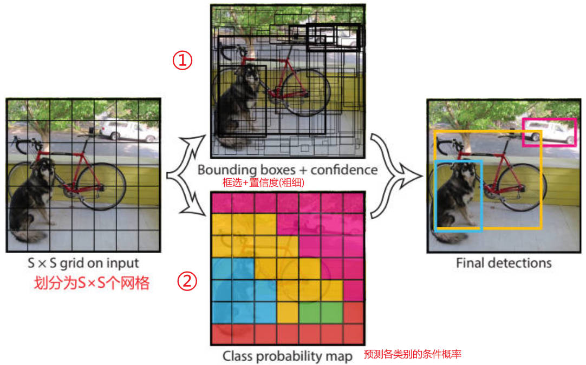

# YOLO_intro

> [官网](https://pytorch.org/) | [帮助文档](https://pytorch.org/docs/stable/index.html)

## 1.Pytorch 模块

基础入门：[动手学深度学习-Pytorch实现](https://zh.d2l.ai/chapter_preface/index.html)

### 1.1 文件夹内容说明

**Torch 文件夹**

位置：`\Lib\site-packages\torch` 

1.`__pycache__`：一个缓存文件夹，保存由 python 解释器将对应模块提前生成的字节码，节省后续时间单增加了存储空间

2.`_C`：辅助 C 语言调用，PyTorch 的底层计算代码采用的是C++语言编写并封装成库，供 pytorch 的 python 语言进行调用

3.`include`：C++ 头文件代码

4.`lib`：包含大量的 `.lib` 和 `.dll` 文件，即静态链接库和动态链接库，供各类顶层 python api 调用

5.`autograd`：实现梯度的自动求导，开发者只需编写前向传播代码

6.`nn` 和 `optim`：核心网络层模块和优化模块

**Torchvision 文件夹**

位置：`\Lib\site-packages\torchvision` 

1.`datasets`：官方的数据读取函数，如 coco，mnist，cifar 等

2.`models`：经典可复现的模型库，可模仿代码结构，函数，类组织等

3.`tansforms`：视觉增强库，pytorch 自带的图像预处理，增强，转换工具

### 1.2 快速入门


## 2.YOLO 算法

> [YOLO 论文搜索](https://arxiv.org/)

### 2.1 概述

实时目标检测：一般要求帧率 FPS > 30；

图像分类 (Classification) ：仅做整体图片的分类，**即输出对应图片的类别**

图像分类+定位 (Localization)：将图像中的物体框选出来定位

目标检测 (Object Detection)：多个类别，**多个物体框选出来并分类**，实现每个物体的区分

**图像分割 (Segmentation)**

语义分割 (Semantic Segmentation)：对每个像素分类

实例分割 (Instance Segmentation)：进一步区分同一类比的不同实例，精确到每个个体

关键点检测 (Keypoint Detection)：检测肢体动作


**目标检测**

单阶段模型：端到端的，直接输入，得到输出，如 YOLO

两阶段模型：先提取，再分类，准确性较高但是耗时，DPM: (Deformable Part Models)。


### 2.2 YOLOV1

> [YOLOv1](https://pjreddie.com/darknet/yolov1/)

#### 1.预测阶段

**模型已经训练成功**，输入未知图片对其进行预测，只需要前向推断，得到预测结果。


**输入：448×448×3**

**输出：7×7×30**  每个网格包含两个预测框和 20 个类别的条件概率，每个个框包含 5 个参数 (x, y, w, h, c)

**组成分析**

划分为 s × s 个网格，每个网格对应 b 个预测框，此处 s = 7,b= 2

7×7×64-s-2：64 卷积核的个数，stride ：2

- 24 个全连接层提取图像特征：1 + 1 + 4 + (2×4 + 2) + (2×2 + 1) + 2 + 1 = 24

- 2 层全连接层得到 7×7×30 ，4096 => 1470 => 7×7×30



S 个 girdcell B 个 bounding box。对于 YOLOV1，图片分成 7×7 的网格，每个 girdcell 生成 2 个中心点在网格内的 bounding box (预测框)。

预测框包含 (x, y, w, h, c)：(x, y) 为中心点的坐标，(w, h) 为框的宽高，c 是判断的置信度，在图像中表示为线框的粗细。

①：各个 girdcell 对应的 bounding box(一般2个) 和相应置信度的大小

②：girdcell 对所**包含**各类别的概率

#### 2.预测框筛选

**检测框中心点 => 检测框的宽度和高度 => 检测框中是否含有物体 => 有物体的条件下，则是各个种类的概率；**

两个框对应的置信度乘以对应类别的的条件概率，得到各个类别的全概率，最终得到预测的”全框图“。


**对预测后的”全框图“的处理**：

1. 先通过设定的阈值，过滤掉较小概率；

2. 通过 NMS 算法得到最终的结果

   Non-max suppression (NMS) 的步骤：1.找到概率值最大的一个边框；2.找到与这个边框重叠的边框，即交并比很高的其他边框（根据设定的阈值过滤）；3.重复上面的两步。

#### 3.训练阶段

YOLOv1 将目标检测问题转换为回归问题求解；

损失函数 (bbox-bounding box)：

- 负责检测物体的 bbox 中心点定位误差；
- 负责检测物体的 bbox 宽高定位误差；
- 负责检测物体的 bbox 的 Confidence 误差；
- 不负责检测物体的 bbox 的 Confidence 误差；
- 负责检测物体的 grid cell 分类误差；

**人工标注**

人工标注的框的中心点在那个网格中，则由该网格的框进行预测；

选择与标注的框交并比最大的框去拟合，YOLOv2 增加 Anchor box，用于区分多个物体同一中心点；

预测的类别也是人工标注的类别；

#### 4.YOLOv1 论文

Visual Object Classes Challenge 2012 (VOC 2012) 数据集，20 个类别；

相比于传统的两阶段模型，YOLO 是全图输入，泛化能力更强；

而两阶段的模型依赖于上一步的结果，前一步的结果会对后一步的结果产生很大的影响；

特点：速度快且简单，准确率还可以

v1 训练时所用的图片是 224×224，测试时使用的是 448×448；

**不足**

- 每个网格只预测一个类别，重叠则无法解决
- 小物体的检测一般，定位误差较大，只有 2 个框框

### 2.3 YOLOv2

> [YOLOv2](https://pjreddie.com/darknet/yolov2/)

输入；416×416×3

输出：13×13

**变动**

- 舍弃了 Dropout ，加入了 Batch Normalization，卷积层后 + BN。相当于对每一层做了归一化处理，训练可控性增强，更容易收敛；
- 更大的分辨率，鉴于 v1 训练时所用的图片是 224×224，v2 进行了 10 次 448×448 次的微调，提高分类器的高分辨率；
- 网络结构，实际输入为 416×416 (32 的奇数倍)，消除了全连接层(训练慢，容易过拟合)，增加 5 次下采样 (Maxpool)，即 $(h,w)=>(h/32,w/32)$

- 输出 13×13（416/32=13） 网格划分

**聚类提取先验框**

聚类的距离 k-means：distance = 1 - IOU

引入 Anchor Box ，使得预测的 box 数量增多，变为 13×13×n，查全率 recall 增加；

**偏移量**

使用相对偏移量；

**感受野**

特征点能够看到多大的区域，使用小的卷积核，所需的参数更小，使用多个卷积层，增加在每个层的后面 + BN；

最后一层的感受野最大，适合大目标，需要融合之前的特征，减少小物体的识别误差；

### 2.4 YOLOv3

> [YOLOv3](https://pjreddie.com/darknet/yolo/)

#### 1.改进的细节

**多 scale 方法的改进和特征融合**

- 使用了 3 种不同规格的图片，13×13，26×26，52×52，格子越小，预测小物体越准确；
- 增加了 26×26，52×52 的网格划分形式，用于预测小物体，每个规格有 3 个候选框，共 9 种框框；

- 一次计算，前后融合，后面的结果通过上采样，如 13×13 变为 26×26，并与中间的 26×26 叠加；

- 对不同的特征图融合后进行预测；


**使用残差连接的思想方法**

**核心网络架构**

- 无池化 (步长变为 2) 和全连接层，全部为卷积层；

- 32 倍下采样—13×13—大目标检测；
- 16 倍下采样—26×26—小目标检测；

- 8 倍下采样—52×52—小目标检测；


**先验框的设计**


**单物体多分类的 sofmax 改进**

一个物体有多个标签，如预测是猫，具体猫的种类；

#### 2.源码解读

[YOLOv3 源码下载](https://github.com/eriklindernoren/PyTorch-YOLOv3)

**coco 数据集下载**

train2014 (12.58G)：https://pjreddie.com/media/files/train2014.zip 

val2014 (6.19G)：https://pjreddie.com/media/files/val2014.zip (下载速度慢可使用迅雷增速)

[coco](https://cocodataset.org/#home)，COCO数据集是一个可用于图像检测（image detection），语义分割（semantic segmentation）和图像标题生成（image captioning）的大规模数据集。它有超过330K张图像（其中220K张是有标注的图像）。

包含150万个目标，80个目标类别（object categories：行人、汽车、大象等），91种材料类别（stuff categoris：草、墙、天空等），每张图像包含五句图像的语句描述，且有250,000个带关键点标注的行人。

**模型权重集下载**

根据 `download_weights.sh` 文件内容下载预训练模型的权重参数；

```python

```


#### 3.Poetry env

[Poetry英文官方网站](https://python-poetry.org/) | [Poetry官方函数库](https://pypi.org/project/poetry/)

介绍：[使用 Python Poetry 进行依赖项管理(译文)](https://muzing.top/posts/3fa905f9/) | [英文原文](https://realpython.com/dependency-management-python-poetry/)
